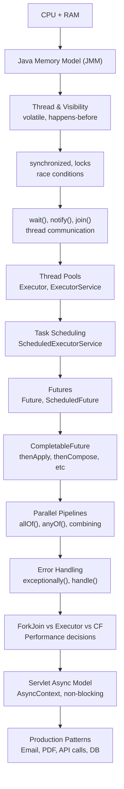

# Thread Road map

```mermaid
flowchart TD
    A["CPU + RAM"] --> B["Java Memory Model (JMM)"]
    B --> C["Thread & Visibility<br/>volatile, happens-before"]
    C --> D["synchronized, locks<br/>race conditions"]
    D --> E["wait(), notify(), join()<br/>thread communication"]
    E --> F["Thread Pools<br/>Executor, ExecutorService"]
    F --> G["Task Scheduling<br/>ScheduledExecutorService"]
    G --> H["Futures<br/>Future, ScheduledFuture"]
    H --> I["CompletableFuture<br/>thenApply, thenCompose, etc"]
    I --> J["Parallel Pipelines<br/>allOf(), anyOf(), combining"]
    J --> K["Error Handling<br/>exceptionally(), handle()"]
    K --> L["ForkJoin vs Executor vs CF<br/>Performance decisions"]
    L --> M["Servlet Async Model<br/>AsyncContext, non-blocking"]
    M --> N["Production Patterns<br/>Email, PDF, API calls, DB"]
```
