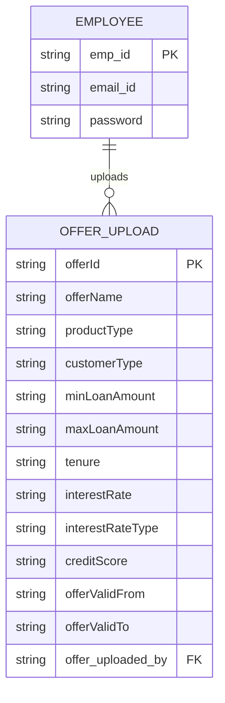

```mermaid
erDiagram
    EMPLOYEE ||--o{ OFFER_UPLOAD : uploads
    
    EMPLOYEE {
        string emp_id PK
        string email_id
        string password
    }

    OFFER_UPLOAD {
        string offerId PK
        string offerName
        string productType
        string customerType
        string minLoanAmount
        string maxLoanAmount
        string tenure
        string interestRate
        string interestRateType
        string creditScore
        string offerValidFrom
        string offerValidTo
        string offer_uploaded_by FK
    }
```
