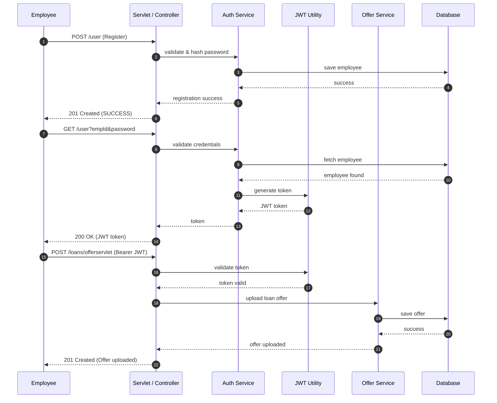

```mermaid
sequenceDiagram
    autonumber

    participant Emp as Employee
    participant API as Servlet / Controller
    participant Auth as Auth Service
    participant JWT as JWT Utility
    participant Offer as Offer Service
    participant DB as Database

    Emp->>API: POST /user (Register)
    API->>Auth: validate & hash password
    Auth->>DB: save employee
    DB-->>Auth: success
    Auth-->>API: registration success
    API-->>Emp: 201 Created (SUCCESS)

    Emp->>API: GET /user?empId&password
    API->>Auth: validate credentials
    Auth->>DB: fetch employee
    DB-->>Auth: employee found
    Auth->>JWT: generate token
    JWT-->>Auth: JWT token
    Auth-->>API: token
    API-->>Emp: 200 OK (JWT token)

    Emp->>API: POST /loans/offerservlet (Bearer JWT)
    API->>JWT: validate token
    JWT-->>API: token valid
    API->>Offer: upload loan offer
    Offer->>DB: save offer
    DB-->>Offer: success
    Offer-->>API: offer uploaded
    API-->>Emp: 201 Created (Offer uploaded)
```
